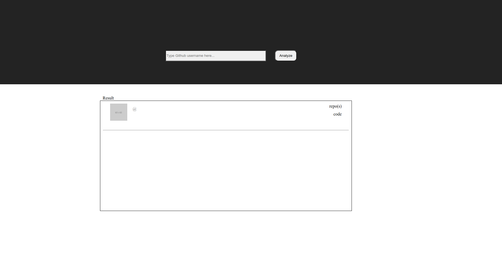
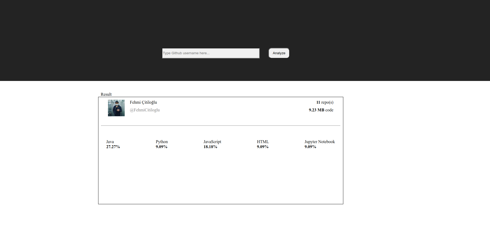
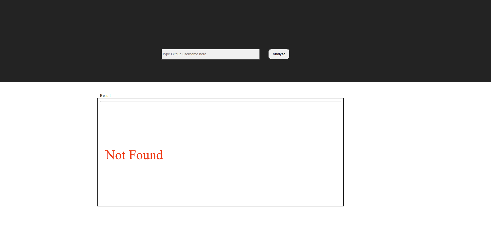

### Github profile analyzer

- To use just simply open index.html with your browser that support javascript

* And then write username you wanna analyse to input area

-> Here start page

- if you write a username page looks like this..(I hope... At least it is looks like this in my computer)
  

* if you would write username that is not exist you gonna take an error like this..(but don't try 'asdasda' I don't know why it is not throwing any error)

  
